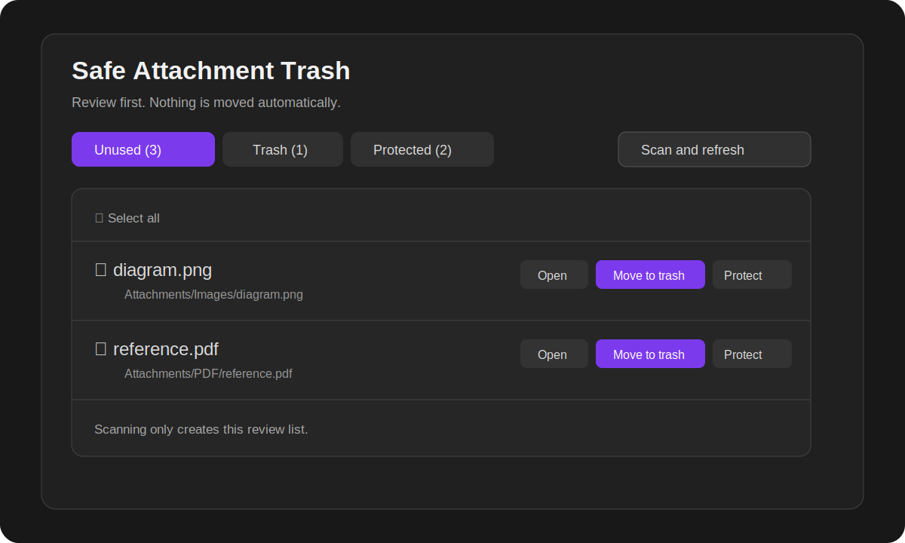
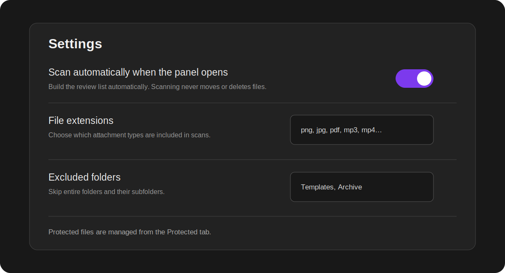

# Safe Attachment Trash

Safely find unused attachments, review them before moving anything, protect files you want to keep, and restore trashed files to their original folders.

> **Nothing is moved or deleted during a scan.** The plugin only builds a review list. A file moves to trash only after you choose it.



## How it works

1. Open **Safe Attachment Trash** from the ribbon or Command palette.
2. Review the files in the **Unused** tab. Click a file to open it before making a decision.
3. Choose **Move to trash** or **Never suggest**.
4. Use the **Trash** tab to preview, restore, or permanently delete trashed files.

## Main features

- Optional automatic scanning when the panel opens.
- Manual **Scan and refresh** mode when automatic scanning is disabled.
- Scans never move or delete files automatically.
- Opens images, PDFs, audio, video, and other supported attachments before removal.
- **Protected files** list for attachments that should never be suggested again.
- Checks links, embeds, note properties/frontmatter, Canvas files, and Bases files.
- Re-checks selected files immediately before moving them, preventing stale scan results from removing newly used files.
- Uses the app's trash behavior and remembers original paths for restoration.
- Restore or permanently delete one file or many files at once.
- Persian and English interface.
- No account, network access, telemetry, or advertisements.

## Automatic or manual scanning

Open **Settings → Safe Attachment Trash** and choose whether the panel scans automatically when opened.

- **Enabled:** opening the panel refreshes the review list.
- **Disabled:** scanning happens only when you press **Scan and refresh** or run the scan command.

In both modes, scanning is read-only. It never moves files.



## Protect files from future suggestions

Some files may be intentionally kept even though they are not currently linked.

From the **Unused** tab, choose **Never suggest**. The file stays in its current folder and moves to the **Protected** tab. It will be excluded from future scans until you choose **Suggest again**.

## Bases and properties

Attachments referenced in note properties are treated as used, including single values and lists such as:

```yaml
---
cover: "[[Attachments/book-cover.jpg]]"
images:
  - "[[Attachments/page-1.png]]"
  - "[[Attachments/page-2.png]]"
---
```

The scanner also checks direct attachment paths stored in `.base` files.

## Safety notes

- Back up important vaults before using any cleanup tool.
- Review files before moving them.
- Permanent deletion from the Trash tab cannot be undone by this plugin.
- If another file appears at the original restore path, the conflict behavior can be changed in settings.

<details>
<summary>راهنمای کوتاه فارسی</summary>

1. پنل افزونه را باز کن.
2. فایل‌های پیدا‌شده در تب **بلااستفاده** فقط برای بررسی نمایش داده می‌شوند و خودکار حذف نمی‌شوند.
3. روی فایل کلیک کن تا باز شود.
4. برای انتقال، **انتقال به Trash** را بزن.
5. برای فایل‌هایی که باید همیشه نگه داشته شوند، **دیگر پیشنهاد نده** را انتخاب کن.
6. فایل‌های منتقل‌شده از تب **Trash** قابل مشاهده و بازگردانی هستند.

اسکن خودکار را می‌توانی از تنظیمات خاموش کنی؛ در آن حالت فقط دکمه **اسکن و تازه‌سازی** بررسی را انجام می‌دهد.

</details>

<details>
<summary>Technical details</summary>

- The plugin enumerates vault files because unused-file detection requires comparing attachments with references across notes, properties, Canvas, and Bases files.
- Plugin settings, protected paths, and restore metadata are stored with the standard plugin data API.
- Hidden local trash files are accessed through the Adapter API because hidden folders are not exposed by the normal Vault file list.
- File moves use `FileManager.trashFile()` so the user's deletion preference is respected.

</details>

## Reporting issues

Please include the app version, plugin version, operating system, and a small example showing the unexpected result.

## License

MIT
