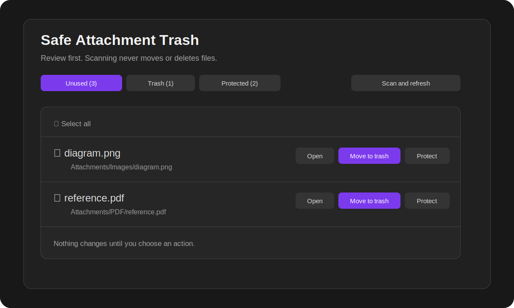
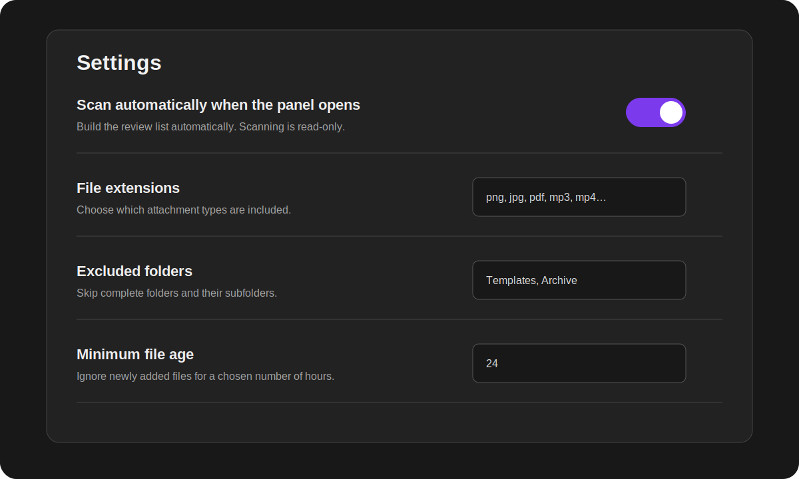
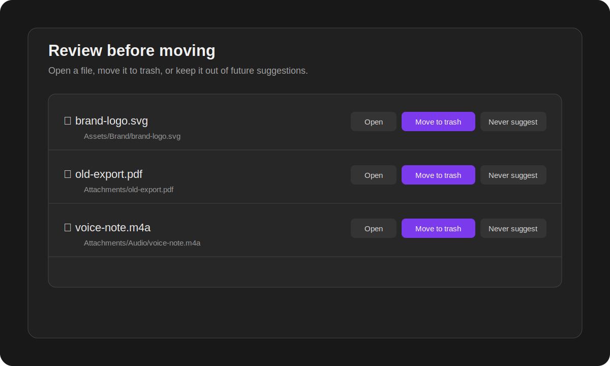
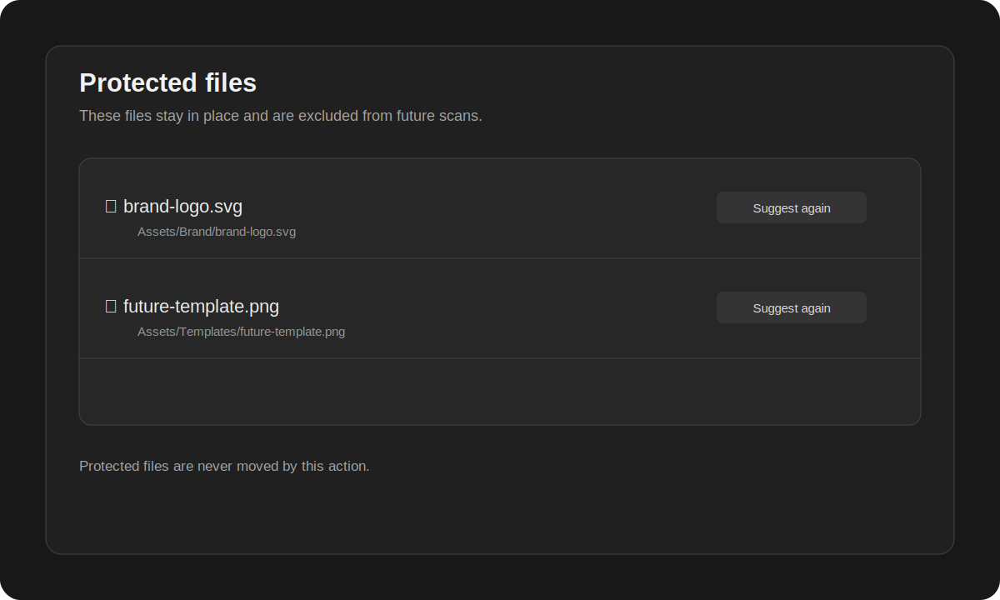
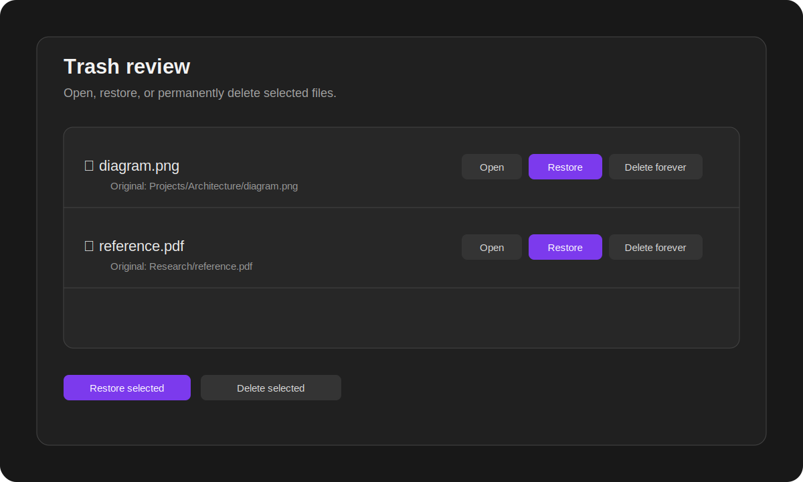
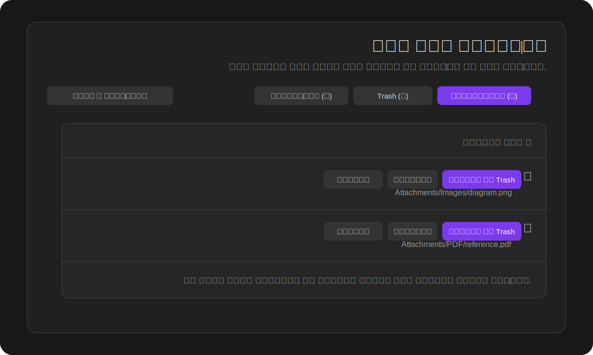
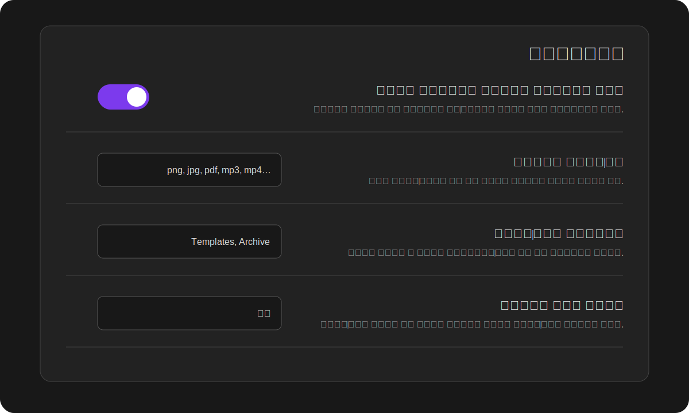
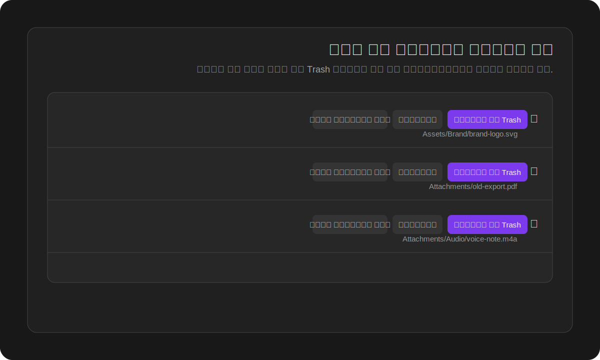
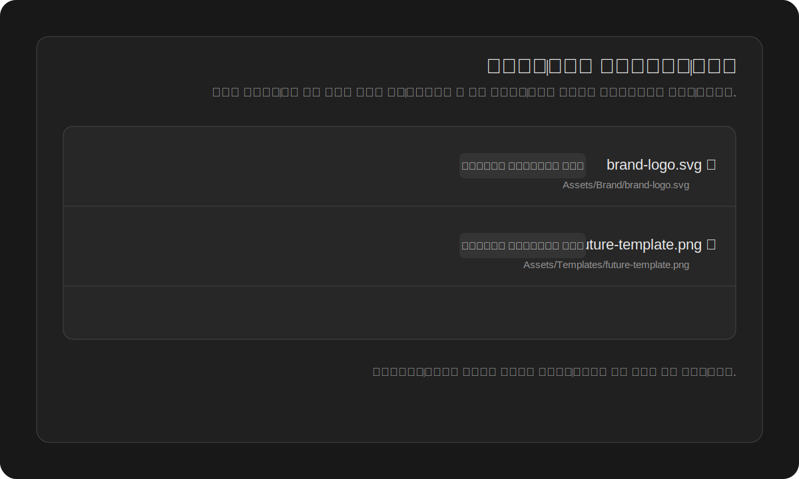
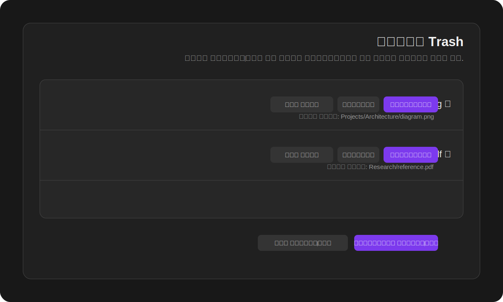

# Safe Attachment Trash

[English](#english) · [فارسی](#فارسی)

---

<a id="english"></a>

## English

**Find attachments that appear unused, review them safely, and decide what should happen.**

> **A scan never moves or deletes anything.** It only creates a review list. Files move to trash only after you explicitly select them and confirm the action.



### Why use it?

A vault can gradually collect screenshots, PDFs, audio, video, exported files, and documents that are no longer referenced. Deleting them manually is risky because a file may still be used in a note property, Canvas, or Base.

Safe Attachment Trash adds a review-first workflow:

- scan for files that appear unused;
- open each file before deciding;
- keep intentional standalone files out of future suggestions;
- move selected files to the app's trash only after confirmation;
- restore trashed files to their original location;
- permanently delete only the files you explicitly select.

### Quick start

1. Open **Settings → Community plugins → Safe Attachment Trash** and enable the plugin.
2. Open the plugin from the ribbon icon or Command palette.
3. Review the **Unused** tab.
4. Click a row or **Open** to inspect the file in the main workspace.
5. Choose one of these actions:
   - **Move to trash** — moves only the selected file(s).
   - **Never suggest** — keeps the file where it is and excludes it from future scans.
6. Use the **Trash** tab to open, restore, or permanently delete files.

### Automatic or manual scanning

You control when scanning runs.



- **Automatic scan enabled:** opening the plugin panel refreshes the Unused list.
- **Automatic scan disabled:** nothing is scanned until you press **Scan and refresh** or run the scan command.

In both modes, scanning is read-only. It never moves or deletes files.

### The three tabs

#### Unused

This is a review list of files that currently appear unreferenced.



Available actions:

- **Open** — inspect the file before making a decision.
- **Move to trash** — move selected files only after confirmation.
- **Never suggest** — protect selected files from future suggestions.
- **Select all** — select all currently visible results, including filtered search results.

Before moving anything, the plugin scans the selected files again. If a file became referenced after the original scan, it is skipped.

#### Protected

Use this for files that are intentionally kept even when they are not linked from a note.

Examples:

- a logo used outside the vault;
- a template asset kept for future notes;
- a reference PDF you want to archive;
- a file used by another tool.

Protected files stay in their original folders. They are only excluded from future suggestions. Use **Suggest again** to remove protection.



#### Trash

The Trash tab shows files managed through the local trash workflow.



You can:

- open a trashed image, PDF, audio, video, or supported text file;
- restore one or multiple selected files;
- restore files to their remembered original folders;
- permanently delete one or multiple selected files;
- choose how restore conflicts are handled.

### What the scanner checks

The scanner treats an attachment as used when it is referenced through supported local references, including:

- Markdown links and embeds;
- resolved internal links;
- note Properties and YAML frontmatter;
- single-value and list Properties;
- Canvas files;
- direct local attachment paths stored in `.base` files.

Examples that are treated as references:

```yaml
---
cover: "[[Attachments/book-cover.jpg]]"
images:
  - "[[Attachments/page-1.png]]"
  - "[[Attachments/page-2.png]]"
---
```

```markdown
![[Attachments/diagram.png]]
[Open the PDF](Attachments/reference.pdf)
```

Remote URLs such as `https://...` are not treated as local vault files.

### Settings reference

| Setting | What it does |
|---|---|
| Language | Automatically follow the app language, or force Persian/English. |
| Scan automatically when the panel opens | Refresh the Unused list whenever the panel opens. Disable it for a fully manual workflow. |
| File extensions | Choose which file types are included in scans. Separate extensions with commas. Use `*` for all extensions. |
| Excluded folders | Skip complete folders and their subfolders. Separate paths with commas or new lines. |
| Minimum file age | Ignore files newer than the chosen number of hours. Useful for files you recently added but have not linked yet. |
| Restore conflict behavior | Rename the restored copy, skip it, or overwrite an existing file at the original path. |
| Unknown-path recovery folder | Destination for trashed files whose original location cannot be determined. |
| Check Canvas files | Prevent files referenced in Canvas from being suggested as unused. |

### Safety model

- Scanning is read-only.
- No file is moved during automatic scanning.
- No file is moved during manual scanning.
- A file moves only after explicit selection and confirmation.
- Selected files are re-checked immediately before moving.
- Original paths are stored so managed files can be restored.
- Permanent deletion always requires confirmation.

Even with these safeguards, keep a backup of important vaults before using any cleanup tool.

### Privacy

The plugin works locally inside the vault. It does not require an account and does not include telemetry, advertisements, or network requests.

### Installation

Install from:

**Settings → Community plugins → Browse → Safe Attachment Trash**

After installation, enable it from the Installed plugins list.

### Reporting a problem

When reporting an issue, include:

- app version;
- plugin version;
- desktop or mobile platform;
- the file path that was incorrectly suggested;
- a small example of the note, Property, Canvas, or Base that references it.

---

<a id="فارسی"></a>

## فارسی

**فایل‌های پیوستِ ظاهراً بلااستفاده را پیدا کن، قبل از هر کاری بررسی‌شان کن و خودت تصمیم بگیر چه اتفاقی برایشان بیفتد.**

> **اسکن هیچ فایلی را جابه‌جا یا حذف نمی‌کند.** اسکن فقط یک فهرست برای بررسی می‌سازد. فایل تنها زمانی به Trash می‌رود که خودت آن را انتخاب و عملیات را تأیید کنی.



### چرا از این افزونه استفاده کنیم؟

با گذشت زمان ممکن است تعداد زیادی تصویر، PDF، فایل صوتی و ویدئویی، خروجی برنامه‌ها و سند داخل Vault جمع شود. حذف دستی این فایل‌ها خطرناک است؛ چون ممکن است فایل هنوز داخل یک Property، Canvas یا Base استفاده شده باشد.

Safe Attachment Trash یک فرایند امن و مبتنی بر بررسی ایجاد می‌کند:

- فایل‌هایی را که ظاهراً بلااستفاده‌اند پیدا می‌کند؛
- اجازه می‌دهد قبل از تصمیم‌گیری فایل را باز کنی؛
- فایل‌هایی را که عمداً نگه داشته‌ای از پیشنهادهای بعدی خارج می‌کند؛
- فقط با انتخاب و تأیید تو فایل را به Trash منتقل می‌کند؛
- مسیر اصلی فایل را برای بازگردانی نگه می‌دارد؛
- فقط فایل‌هایی را که خودت انتخاب کرده‌ای برای همیشه حذف می‌کند.

### شروع سریع

1. از مسیر **Settings → Community plugins → Safe Attachment Trash** افزونه را فعال کن.
2. پنل افزونه را از آیکن نوار کناری یا Command palette باز کن.
3. فایل‌های تب **بلااستفاده** را بررسی کن.
4. روی ردیف فایل یا دکمه **بازکردن** بزن تا فایل در فضای اصلی برنامه باز شود.
5. یکی از این کارها را انتخاب کن:
   - **انتقال به Trash** — فقط فایل‌های انتخاب‌شده را منتقل می‌کند.
   - **دیگر پیشنهاد نده** — فایل را سر جای خودش نگه می‌دارد و در اسکن‌های بعدی نشان نمی‌دهد.
6. از تب **Trash** فایل‌ها را باز، بازیابی یا برای همیشه حذف کن.

### اسکن خودکار یا دستی

زمان اجرای اسکن کاملاً در اختیار کاربر است.



- **اسکن خودکار روشن باشد:** با بازشدن پنل افزونه، فهرست فایل‌های بلااستفاده تازه می‌شود.
- **اسکن خودکار خاموش باشد:** تا زمانی که دکمه **اسکن و تازه‌سازی** را نزنی یا دستور اسکن را اجرا نکنی، بررسی انجام نمی‌شود.

در هر دو حالت، اسکن فقط خواندنی است و هیچ فایلی را جابه‌جا یا حذف نمی‌کند.

### سه بخش اصلی افزونه

#### بلااستفاده

این بخش فایل‌هایی را نشان می‌دهد که در اسکن فعلی هیچ ارجاع پشتیبانی‌شده‌ای برایشان پیدا نشده است.



کارهایی که می‌توانی انجام دهی:

- **بازکردن** — قبل از تصمیم‌گیری، محتوای فایل را ببین.
- **انتقال به Trash** — فقط فایل‌های انتخاب‌شده را پس از تأیید منتقل کن.
- **دیگر پیشنهاد نده** — فایل را محافظت کن تا در اسکن‌های بعدی نمایش داده نشود.
- **انتخاب همه** — تمام نتایج قابل‌مشاهده، از جمله نتایج فیلترشده، انتخاب می‌شوند.

افزونه درست قبل از انتقال، فایل‌های انتخاب‌شده را دوباره بررسی می‌کند. اگر فایلی بعد از اسکن اولیه در جایی استفاده شده باشد، انتقال آن رد می‌شود.

#### محافظت‌شده

این بخش برای فایل‌هایی است که عمداً نگه داشته‌ای، حتی اگر فعلاً داخل یادداشت‌ها لینک نشده باشند.

مثال‌ها:

- لوگویی که بیرون از Vault استفاده می‌شود؛
- تصویری که برای یادداشت‌های آینده نگه داشته‌ای؛
- PDF مرجعی که قصد آرشیوشدن دارد؛
- فایلی که ابزار دیگری از آن استفاده می‌کند.

فایل محافظت‌شده جابه‌جا نمی‌شود و در همان مسیر اصلی باقی می‌ماند. فقط از اسکن‌های بعدی کنار گذاشته می‌شود. با گزینه **دوباره پیشنهاد بده** می‌توانی محافظت را برداری.



#### Trash

این بخش فایل‌هایی را نشان می‌دهد که از طریق جریان Trash محلی مدیریت شده‌اند.



در این بخش می‌توانی:

- تصویر، PDF، صوت، ویدئو و فایل متنی پشتیبانی‌شده را باز کنی؛
- یک یا چند فایل انتخاب‌شده را بازگردانی کنی؛
- فایل‌های مدیریت‌شده را به پوشه اصلی‌شان برگردانی کنی؛
- یک یا چند فایل را برای همیشه حذف کنی؛
- نحوه برخورد با فایل هم‌نام در مسیر بازگردانی را تعیین کنی.

### افزونه چه ارجاع‌هایی را بررسی می‌کند؟

فایل زمانی استفاده‌شده محسوب می‌شود که از طریق یکی از ارجاع‌های محلی پشتیبانی‌شده به آن اشاره شده باشد، از جمله:

- لینک‌ها و Embedهای Markdown؛
- لینک‌های داخلی resolveشده؛
- Properties و Frontmatter یادداشت‌ها؛
- Propertyهای تک‌مقداری و لیستی؛
- فایل‌های Canvas؛
- مسیرهای مستقیم فایل‌های محلی داخل فایل‌های `.base`.

نمونه Propertyهایی که به‌عنوان استفاده از فایل شناخته می‌شوند:

```yaml
---
cover: "[[Attachments/book-cover.jpg]]"
images:
  - "[[Attachments/page-1.png]]"
  - "[[Attachments/page-2.png]]"
---
```

```markdown
![[Attachments/diagram.png]]
[بازکردن PDF](Attachments/reference.pdf)
```

آدرس‌های اینترنتی مانند `https://...` به‌عنوان فایل محلی Vault در نظر گرفته نمی‌شوند.

### راهنمای کامل تنظیمات

| تنظیم | کاربرد |
|---|---|
| زبان | استفاده خودکار از زبان برنامه یا انتخاب دستی فارسی و انگلیسی. |
| اسکن خودکار هنگام بازشدن پنل | با هر بار بازکردن پنل، فهرست بلااستفاده‌ها تازه می‌شود. برای فرایند کاملاً دستی خاموشش کن. |
| پسوند فایل‌ها | مشخص می‌کند چه نوع فایل‌هایی اسکن شوند. پسوندها را با کاما جدا کن و برای همه پسوندها از `*` استفاده کن. |
| پوشه‌های مستثنا | یک پوشه و تمام زیرپوشه‌هایش را از اسکن خارج می‌کند. مسیرها را با کاما یا خط جدید جدا کن. |
| حداقل عمر فایل | فایل‌های جدیدتر از تعداد ساعت مشخص‌شده را نادیده می‌گیرد؛ برای فایل‌هایی مفید است که تازه اضافه شده‌اند و هنوز لینک نشده‌اند. |
| برخورد با تداخل هنگام بازگردانی | در صورت وجود فایل هم‌نام، نسخه جدید بسازد، عملیات را رد کند یا فایل موجود را جایگزین کند. |
| پوشه بازیابی مسیرهای نامشخص | مقصد فایل‌هایی که مسیر اصلی‌شان قابل تشخیص نیست. |
| بررسی فایل‌های Canvas | فایل‌های استفاده‌شده داخل Canvas را از فهرست بلااستفاده خارج می‌کند. |

### مدل ایمنی افزونه

- اسکن فقط خواندنی است.
- اسکن خودکار هیچ فایلی را منتقل نمی‌کند.
- اسکن دستی هیچ فایلی را منتقل نمی‌کند.
- فایل فقط پس از انتخاب و تأیید مستقیم کاربر منتقل می‌شود.
- فایل‌های انتخاب‌شده درست قبل از انتقال دوباره بررسی می‌شوند.
- مسیر اصلی فایل‌های مدیریت‌شده برای بازگردانی ذخیره می‌شود.
- حذف دائمی همیشه تأیید جداگانه می‌خواهد.

با وجود این موارد، قبل از استفاده از هر ابزار پاک‌سازی از Vaultهای مهم نسخه پشتیبان داشته باش.

### حریم خصوصی

تمام پردازش‌ها به‌صورت محلی داخل Vault انجام می‌شوند. افزونه به حساب کاربری نیاز ندارد و شامل تله‌متری، تبلیغات یا درخواست شبکه نیست.

### نصب

از این مسیر نصب کن:

**Settings → Community plugins → Browse → Safe Attachment Trash**

بعد از نصب، افزونه را از فهرست Installed plugins فعال کن.

### گزارش مشکل

هنگام ثبت مشکل این اطلاعات را بنویس:

- نسخه برنامه؛
- نسخه افزونه؛
- سیستم‌عامل یا موبایل؛
- مسیر فایلی که اشتباه پیشنهاد شده؛
- نمونه کوتاهی از یادداشت، Property، Canvas یا Base که از آن فایل استفاده می‌کند.

---

<details>
<summary>Development and technical notes / نکات فنی و توسعه</summary>

- File enumeration is required to compare attachments with references across notes, Properties, Canvas, and Bases.
- Settings, protected paths, and restore metadata are stored with the standard plugin data API.
- Hidden local trash files are accessed through the Adapter API because hidden folders are not included in the normal vault file list.
- File moves use `FileManager.trashFile()` so the user's configured deletion behavior is respected.
- The release targets the public 1.12 API line and keeps `minAppVersion` at `1.8.7`.

</details>

## License

MIT
